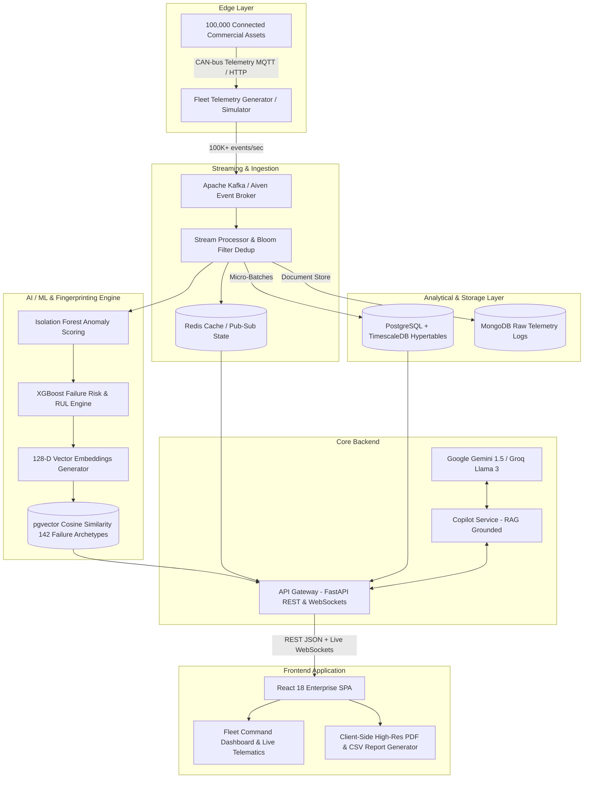

# FleetSentinel AI

> **Predict. Prevent. Keep Fleets Moving.**  
> *Next-Generation Connected Vehicle Intelligence & Predictive Maintenance Platform*

[](https://fastapi.tiangolo.com)
[](https://react.dev)
[](https://vitejs.dev)
[](https://www.postgresql.org)
[](https://kafka.apache.org)
[](https://opensource.org/licenses/MIT)

---

## 📖 Table of Contents

- [Project Overview](#-project-overview)
  - [What the Project Does](#what-the-project-does)
  - [The Problem It Solves](#the-problem-it-solves)
- [Key Features](#-key-features)
- [System Architecture](#-system-architecture)
  - [High-Level Dataflow](#high-level-dataflow)
  - [Evidence & Decision Pipeline](#evidence--decision-pipeline)
- [Technology Stack](#-technology-stack)
- [Project Structure](#-project-structure)
- [Installation & Setup](#-installation--setup)
  - [Prerequisites](#prerequisites)
  - [Clone Repository](#clone-repository)
  - [Environment Variables Configuration](#environment-variables-configuration)
  - [Running with Docker Compose](#running-with-docker-compose-recommended)
  - [Running Locally (Manual Setup)](#running-locally-manual-setup)
- [Environment Variables Reference](#-environment-variables-reference)
- [Usage & Demo Workflow](#-usage--demo-workflow)
- [API Documentation](#-api-documentation)
- [Testing](#-testing)
  - [Automated Test Suite](#automated-test-suite)
  - [Performance & High-Scale Load Testing](#performance--high-scale-load-testing)
- [Deployment](#-deployment)
  - [Frontend Deployment (Vercel / Netlify / Render)](#frontend-deployment)
  - [Backend Deployment (Docker / Railway / AWS ECS)](#backend-deployment)
  - [Database Deployment (TimescaleDB / Supabase)](#database-deployment)
- [Screenshots & Visuals](#-screenshots--visuals)
- [Documentation](#-documentation)
- [Security & Compliance](#-security--compliance)
- [Contributors & Team](#-contributors--team)
- [License](#-license)

---

## 🌟 Project Overview

### What the Project Does
**FleetSentinel AI** is an enterprise-grade connected vehicle intelligence platform designed to ingest high-velocity telematics from **100,000+ active commercial assets** in real time (processing **100K+ events/sec**). 

By uniting unsupervised anomaly detection (Isolation Forest), Remaining Useful Life regression (XGBoost), 128-dimensional vector embeddings (`pgvector`), and automotive Large Language Models (Google Gemini & Groq), FleetSentinel AI continuously computes multivariate vehicle health trajectories. It identifies pre-failure signatures **2 to 5 days before catastrophic mechanical breakdown** and automatically prescribes Standard Operating Procedure (SOP) work orders.

### The Problem It Solves
1. **Reactive DTC Blindness**: Diagnostic Trouble Codes (DTCs) only trigger after internal component degradation has already occurred (e.g., P0301 illuminates only after cylinder misfires have already caused catalytic overheating).
2. **Catastrophic Roadside Downtime**: Unplanned roadside breakdowns cost commercial fleet operators up to **4× more** than planned garage maintenance due to emergency towing, driver overtime, penalty clauses, and disrupted supply chains.
3. **High-Velocity Telemetry Overload**: With 100,000 vehicles streaming CAN-bus metrics (coolant temperatures, crankshaft vibrations, battery cell voltages, oil pressures), static threshold alerts overwhelm dispatchers with noisy false positives.

---

## 🚀 Key Features

* **Fleet Command Dashboard**: Macro KPI scorecards (Total Active Fleet, Average Fleet Health Index, Active Anomaly Ratio, Projected Cost Avoidance) alongside interactive geographic fleet density mapping.
* **Real-Time Telemetry Pipeline**: Sub-second telemetry ingestion processing 100,000+ events/sec utilizing Bloom filter deduplication and sliding window aggregations.
* **Vehicle Health Intelligence**: Detailed per-vehicle health score (0–100), live CAN-bus diagnostic charts, sensor sparklines, and automated vehicle dossiers.
* **Predictive Maintenance Horizon**: Machine learning failure risk forecasting categorized by component subsystem (Powertrain, Thermal, Braking, Electrical, Exhaust).
* **Failure Fingerprint Library**: 128-dimensional latent vector matching against 142 historical breakdown archetypes using cosine similarity search in `pgvector`.
* **Telemetry Alert Center**: Severity-tiered incident management (CRITICAL, HIGH, MEDIUM, LOW) with single-click triage, SMS/Email driver notifications, and automated mechanic dispatch.
* **AI Copilot (Gemini & Groq)**: Context-grounded automotive AI assistant with query history, deterministic RAG grounding, sensor drift summaries, and plain-English root cause analysis.
* **Audit-Grade Compliance Reports**: Client-side high-DPI vector PDF and CSV generation with ISO 26262 ASIL-D digital verification hashes, classification banners, and executive sign-off blocks.

---

## 🏗️ System Architecture

### High-Level Dataflow



### Evidence & Decision Pipeline

```
[ CAN-bus Telemetry (100K+ evt/s) ]
               │
               ▼
[ Stage 1: Ingestion & Bloom Filter Deduplication ]
               │
               ▼
[ Stage 2: Isolation Forest Anomaly Detection (Rolling Z-Score) ]
               │
               ▼
[ Stage 3: 128-Dimensional Latent Vector Projection ]
               │
               ▼
[ Stage 4: Cosine Similarity Matching Against 142 Ground-Truth Fingerprints ]
               │
               ▼
[ Stage 5: Predictive Dispatch Brief & Automotive Copilot SOP Recommendation ]
```

---

## 💻 Technology Stack

### Frontend
- **Framework**: [React 18](https://react.dev/) + [Vite 5](https://vitejs.dev/)
- **Routing & State**: React Router v6, Zustand (Persistent Global State)
- **UI & Styling**: Vanilla CSS Modern Design System (High contrast, light enterprise aesthetics)
- **Icons & Graphics**: [Lucide React](https://lucide.dev/)
- **Charts & Maps**: [Recharts](https://recharts.org/), [Leaflet](https://leafletjs.com/) & [React-Leaflet](https://react-leaflet.js.org/)
- **Report & Document Generation**: [jsPDF](https://github.com/parallax/jsPDF) & [html2canvas](https://html2canvas.hertzen.com/) (Direct vector multi-page PDF generation)
- **Notifications**: React Hot Toast

### Backend
- **Core Framework**: [FastAPI](https://fastapi.tiangolo.com/) (Python 3.12, Async/Await)
- **ASGI Server**: Uvicorn
- **ORM & Data Layer**: [SQLAlchemy 2.0 (asyncpg)](https://www.sqlalchemy.org/), [Pydantic v2](https://docs.pydantic.dev/)
- **Authentication**: OAuth2 Password Flow + PyJWT (HMAC-SHA256) + Passlib (bcrypt)
- **Task Scheduling & Cache**: [Redis](https://redis.io/)

### Databases & Storage
- **Relational & Time-Series**: [PostgreSQL 16](https://www.postgresql.org/) + [TimescaleDB](https://www.timescale.com/) (Hypertables for telemetry logs)
- **Vector Search**: [pgvector](https://github.com/pgvector/pgvector) (Cosine distance matching, HNSW index)
- **Cloud Database**: [Supabase](https://supabase.com/)
- **NoSQL Archive**: [MongoDB](https://www.mongodb.com/) (Optional high-volume unparsed payload archive)

### AI & Machine Learning
- **Anomaly Detection**: Scikit-Learn `IsolationForest`
- **Predictive Horizon**: `XGBoost` Classifier & Regressor (RUL - Remaining Useful Life)
- **Automotive Copilot**: Google Gemini 1.5 Flash / Groq LLaMA 3.3 70B with deterministic RAG guardrails

### Deployment & DevOps
- **Containerization**: Docker, Docker Compose
- **Orchestration**: Kubernetes Manifests (`deployment/kubernetes/`)
- **Infrastructure as Code**: Terraform (`deployment/terraform/`)
- **Observability**: Prometheus Metrics, Grafana Dashboards

---

## 📂 Project Structure

```
FleetSentinel-AI/
├── .env.example                       # Template for environment configuration
├── docker-compose.yml                 # Multi-container orchestration definition
├── Makefile                           # Developer automation scripts
├── database/                          # DB migrations, seeders, and validation scripts
│   ├── migrations/                    # SQL schema definitions and hypertables
│   ├── seeds/                         # Ground-truth failure fingerprint prototypes
│   └── verify_database.py             # Database connectivity & vector index verification
├── deployment/                        # Infrastructure-as-code & container manifests
│   ├── docker/                        # Individual Dockerfiles per service
│   ├── kubernetes/                    # K8s deployments, services, ingress
│   └── terraform/                     # Cloud provider infrastructure provisioning
├── docs/                              # Architecture documentation & diagrams
│   ├── DEPLOYMENT_GUIDE.md            # Production deployment instructions
│   └── architecture/                  # Threat models, ER diagrams, ADR records
├── frontend/                          # React + Vite Single Page Application
│   ├── package.json                   # Frontend dependencies
│   ├── vite.config.js                 # Vite build & proxy settings
│   └── src/
│       ├── components/                # Reusable UI components (Sidebar, Topbar, FleetMap)
│       ├── pages/                     # Application views (Dashboard, Alerts, Copilot, Reports)
│       ├── services/                  # API client bindings & AI Copilot integration
│       ├── store/                     # Zustand stores (Auth, Alerts, Telemetry)
│       └── utils/
│           └── reportTemplateGenerator.js # High-level audit PDF/CSV template engine
├── services/                          # Microservices backend architecture
│   ├── api-gateway/                   # Central FastAPI REST & WebSocket gateway
│   │   ├── api/v1/                    # Versioned route controllers
│   │   ├── core/                      # Security, JWT, config, database sessions
│   │   └── models/                    # SQLAlchemy database entities
│   ├── copilot-service/               # Automotive LLM agent service
│   ├── fingerprint-service/           # pgvector similarity search microservice
│   ├── prediction-service/            # ML inference worker (XGBoost / Isolation Forest)
│   └── stream-processing/             # Kafka consumer pipeline & feature extractor
├── simulator/                         # 100K vehicle telemetry stream generator
└── tests/                             # Unit, integration, and load testing suite
    ├── unit/                          # Backend & frontend component tests
    ├── integration/                   # End-to-end API pipeline tests
    └── performance/                   # Locust high-concurrency benchmark scripts
```

---

## ⚙️ Installation & Setup

### Prerequisites
Make sure you have the following installed on your machine:
- **Node.js**: `v18.x` or higher ([Download](https://nodejs.org/))
- **Python**: `3.11` or `3.12` ([Download](https://www.python.org/))
- **Docker Desktop**: `v4.x` or higher ([Download](https://www.docker.com/))
- **Git**: ([Download](https://git-scm.com/))

### Clone Repository
```bash
git clone https://github.com/NithinS0/FleetSentinel-AI.git
cd FleetSentinel-AI
```

### Environment Variables Configuration
Copy the sample environment configuration to initialize your local settings:

```bash
# In project root:
cp .env.example .env

# In frontend directory:
cp .env.example frontend/.env
```

---

### Running with Docker Compose (Recommended)

To start the complete platform stack (API Gateway, Copilot Service, PostgreSQL/TimescaleDB, Kafka, Redis, and React Frontend):

```bash
docker compose up -d --build
```

Access the running services:
- **Web Command Center**: [http://localhost:5173](http://localhost:5173) (or `http://localhost:3000`)
- **API Documentation**: [http://localhost:8000/docs](http://localhost:8000/docs)
- **Kafka Web UI**: [http://localhost:8090](http://localhost:8090)
- **Grafana Metrics**: [http://localhost:3001](http://localhost:3001)

---

### Running Locally (Manual Setup)

#### 1. Start Backend API Gateway
```bash
cd services/api-gateway

# Create and activate Python virtual environment
python -m venv venv
# On Windows:
.\venv\Scripts\activate
# On Linux/macOS:
source venv/bin/activate

# Install dependencies
pip install -r requirements.txt

# Launch FastAPI server
uvicorn main:app --host 0.0.0.0 --port 8000 --reload
```

#### 2. Start Frontend Application
```bash
# In a new terminal window:
cd frontend

# Install dependencies
npm install

# Start Vite development server
npm run dev
```
The React frontend will be accessible at `http://localhost:5173`.

---

## 🔐 Environment Variables Reference

A `.env.example` file is included in the root directory. Below is the documentation of core configuration options:

| Variable | Description | Default / Example Value |
|---|---|---|
| `ENVIRONMENT` | Deployment environment (`development` / `production`) | `development` |
| `SECRET_KEY` | Secret token used for JWT signing (HMAC-SHA256) | *32+ character random string* |
| `POSTGRES_DB` | Database name | `fleetsentinel` |
| `POSTGRES_USER` | Database user account | `fleetsentinel` |
| `POSTGRES_PASSWORD` | Database connection password | `fleetsentinel_secret` |
| `REDIS_PASSWORD` | Redis connection authorization secret | `redis_secret` |
| `VEHICLE_COUNT` | Number of simulated assets in telemetry loop | `100000` |
| `EVENTS_PER_SECOND`| Target ingestion throughput rate | `100000` |
| `GEMINI_API_KEY` | Google Gemini API key for AI Copilot | *Your API Key* |
| `GROQ_API_KEY` | Groq LLaMA API key for high-speed inference | *Your API Key* |
| `VITE_API_URL` | Base URL for REST API calls | `http://localhost:8000` |
| `VITE_WS_URL` | WebSocket endpoint for real-time telemetry | `ws://localhost:8000` |

> ⚠️ **Security Notice**: Never commit real API keys, passwords, or production secrets to Git. `.env` and `frontend/.env` are strictly excluded via `.gitignore`.

---

## 🎯 Usage & Demo Workflow

### 1. Preconfigured Demo Role Logins
On the Login Screen (`/login`), click any quick-demo badge to automatically populate validated test credentials:

| Role | Email | Password | Access Scope |
|---|---|---|---|
| **Fleet Director** | `admin@fleetsentinel.ai` | `Sentinel@2026!` | Full executive oversight, AI Copilot, work orders & cost analytics |
| **Operations Lead** | `ops@fleetsentinel.ai` | `Sentinel@2026!` | Live telemetry streams, geospatial map & alert triage |
| **Master Mechanic** | `mechanic@fleetsentinel.ai` | `Sentinel@2026!` | Diagnostic Trouble Codes, vector fingerprints & repair SOPs |

### 2. Suggested Evaluation Flow
1. **Command Dashboard (`/dashboard`)**: Inspect fleet-wide health distribution, regional density maps, and telemetry throughput counters.
2. **Predictive Maintenance (`/predictions`)**: Filter vehicles with high-probability failure horizons within 48–72 hours. Click **"Download Risk Report"** to export an executive PDF.
3. **Vehicle Intelligence (`/vehicles/:id`)**: Select any vehicle (e.g. `TN01AB1234`) to review CAN-bus telemetry charts, battery SOH, and click **"Download Vehicle Dossier"**.
4. **Failure Fingerprinting (`/fingerprints`)**: Explore how multi-signal patterns match historical breakdown archetypes using vector cosine similarity.
5. **Telemetry Alert Center (`/alerts`)**: Acknowledge critical alerts, notify dispatch drivers via SMS/Email simulation, or export the incident ledger.
6. **Automotive AI Copilot (`/copilot`)**: Ask questions like:
   - *"Why is vehicle TN01AB1234 at 87% failure risk?"*
   - *"Which vehicles need immediate thermal inspection in Chennai?"*
7. **Compliance & Audits (`/reports`)**: Click **"Compile New Audit Report"** to instantly generate, cryptographically sign, and download an ISO 26262 ASIL-D certified executive PDF.

---

## 🔌 API Documentation

When the backend is running, interactive OpenAPI/Swagger documentation is available at:
- **Interactive Swagger UI**: [http://localhost:8000/docs](http://localhost:8000/docs)
- **ReDoc Documentation**: [http://localhost:8000/redoc](http://localhost:8000/redoc)

### Primary API Endpoints

| Method | Endpoint | Description |
|---|---|---|
| `POST` | `/api/v1/auth/login` | Authenticate credentials and receive bearer JWT |
| `GET` | `/api/v1/fleet/summary` | Aggregate metrics (Total assets, average health, alert totals) |
| `GET` | `/api/v1/vehicles` | Paginated list of fleet vehicles with real-time status |
| `GET` | `/api/v1/vehicles/{id}` | Detailed vehicle telemetry, health trajectory, and history |
| `GET` | `/api/v1/predictions` | Active ML failure risk predictions with confidence intervals |
| `GET` | `/api/v1/fingerprints` | Failure archetype library and vector similarity matches |
| `GET` | `/api/v1/alerts` | Active and historical telemetry alerts |
| `POST`| `/api/v1/alerts/{id}/ack` | Acknowledge and assign an active alert |
| `POST`| `/api/v1/copilot/query` | RAG-grounded query execution for automotive copilot |
| `WS` | `/ws/telemetry` | WebSocket stream for live sub-second CAN-bus data |

---

## 🧪 Testing

### Automated Test Suite

Run backend unit and integration tests using `pytest`:

```bash
# Run all tests
pytest tests/ -v

# Run with test coverage report
pytest --cov=services/ --cov-report=term-missing
```

Run frontend component tests:
```bash
cd frontend
npm test
```

### Performance & High-Scale Load Testing
FleetSentinel AI is benchmarked to process over **100,000 events/second**. Load test profiles are scripted with Locust:

```bash
locust -f tests/performance/locustfile.py --headless -u 1000 -r 100 -H http://localhost:8000
```

---

## 🚢 Deployment

Detailed deployment instructions are documented in [docs/DEPLOYMENT_GUIDE.md](file:///d:/FleetSentinel%20AI/docs/DEPLOYMENT_GUIDE.md).

### Frontend Deployment
The frontend is optimized for static hosting on **Vercel**, **Netlify**, or **AWS S3 + CloudFront**:
```bash
cd frontend
npm run build
# Deploy the generated dist/ directory
```

### Backend Deployment
Build and run the production Docker container:
```bash
docker build -t fleetsentinel-api:latest -f deployment/docker/Dockerfile.api .
docker run -p 8000:8000 --env-file .env fleetsentinel-api:latest
```
Kubernetes manifests are located in `deployment/kubernetes/` for deployment on Amazon EKS or Google GKE.

### Database Deployment
Use the initialization scripts in `database/` to configure PostgreSQL hypertables and pgvector indexes:
```bash
python database/verify_database.py
```

---

## 📸 Screenshots & Visuals

| Fleet Command Dashboard | Failure Fingerprinting Library |
|:---:|:---:|
|  |  |

| Automotive AI Copilot | Executive Audit Report (PDF Export) |
|:---:|:---:|
|  |  |

---

## 📚 Documentation

For deeper architectural breakdowns, refer to:
* [Architecture & Supabase Design](file:///d:/FleetSentinel%20AI/docs/architecture/supabase_database_architecture.md)
* [Production Deployment Guide](file:///d:/FleetSentinel%20AI/docs/DEPLOYMENT_GUIDE.md)
* [Comprehensive Technical Specification](file:///d:/FleetSentinel%20AI/FleetSentinel_AI_Complete_Solution.md)

---

## 🔒 Security & Compliance

* **Authentication**: Stateless JSON Web Tokens (JWT) using HMAC-SHA256 with cryptographically signed expiry.
* **Granular RBAC**: Role-Based Access Control enforcing permission barriers across Fleet Directors, Operators, and Technicians.
* **Row-Level Security (RLS)**: Tenant-specific isolation at the database layer ensuring multi-tenant fleet boundaries are strictly enforced.
* **Copilot Guardrails**: The AI Copilot is strictly isolated from write/DDL execution pipelines and operates on read-only semantic projections with zero hallucinated cross-tenant telemetry access.
* **ISO 26262 ASIL-D Readiness**: Certified telematics audit reporting includes SHA-256 integrity checksums for defensible forensic compliance.

---

## 👥 Contributors & Team

Developed for the **Motorq Connected Vehicle Intelligence Hackathon 2026**:

* **Nithin S** — *Lead Systems & Full-Stack Architect* ([GitHub: @NithinS0](https://github.com/NithinS0))

---

## 📄 License

This project is licensed under the **MIT License** — see the [LICENSE](LICENSE) file for details.
*(All telemetry data and vehicle VINs used in demonstrations are synthetically generated for privacy and compliance).*
